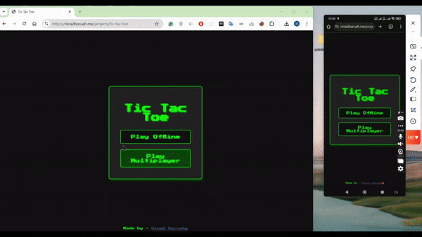

# Tic Tac Toe Multiplayer Game

Experience the classic Tic Tac Toe game with modern features! This project allows players to enjoy the game offline or challenge friends in real-time multiplayer mode. Built with **WebSockets**, **HTML**, **CSS**, and **Node.js**, this game is deployed and ready to play [here](https://ninadbaruah.me/projects/tic-tac-toe).

## Demo Video
[](https://ninadbaruah.me/videos/tic-tac-toe-project.mp4)

Click the image above to watch the video demo.

## Features


### Game Modes

- **Offline Mode:** Play against yourself to practice strategies.
- **Multiplayer Mode:** Play in real-time with friends using WebSockets.

### Customizable Game Board

- **Choose Symbol:** Select your preferred symbol (`X` or `O`).
- **First Move Option:** Decide who starts the game - You or your Opponent.
- **Time Limit:** Set a time limit of 30 seconds per turn.

### Multiplayer Features

- **Shareable Link:** Share the game session link with friends.
- **QR Code Support:** Quickly join games by scanning a QR code.
- **Real-Time Notifications:** Be notified if your opponent leaves mid-game.

### Game Management

- **Reset Game:** Clear the board and start fresh.
- **New Game:** Start a new game session without reloading.

## How It Works

### Backend

- The backend is powered by **Node.js** and handles WebSocket connections for seamless real-time interactions.

### Frontend

- Built using **HTML** and **CSS** with an interactive and responsive UI.

### Deployment

- The game is hosted at: [https://ninadbaruah.me/projects/tic-tac-toe](https://ninadbaruah.me/projects/tic-tac-toe).

## How to Play

1. **Visit the Game**  
   Go to [Tic Tac Toe Multiplayer](https://ninadbaruah.me/projects/tic-tac-toe).
2. **Set Up the Game**  
   Customize your game board by selecting:

   - **Symbol (`X` or `O`)**
   - **First Move (You or Opponent)**
   - **Time Limit (Default: 30 seconds)**

3. **Share the Game**

   - Copy and share the game link.
   - Alternatively, use the QR code to invite your opponent.

4. **Play and Enjoy!**

   - Make your move and wait for your opponent's turn.
   - Notifications will keep you updated if your opponent disconnects.

5. **Manage the Game**
   - Reset the board to replay.
   - Start a new game session anytime.

## Technical Stack

- **Frontend:** HTML, CSS
- **Backend:** Node.js
- **Real-Time Communication:** WebSockets
- **Deployment:** [https://ninadbaruah.me](https://ninadbaruah.me)

## How to Run the Project Locally

1. Clone the repository:
   ```bash
   git clone <repository-url>
   ```
2. Navigate to the project folder:
    ```bash
    cd tic-tac-toe
    ```
3. Install dependencies:
    ```bash
    npm install
    ```
4. Start the server:
    ```bash
    npm run dev
    ````
